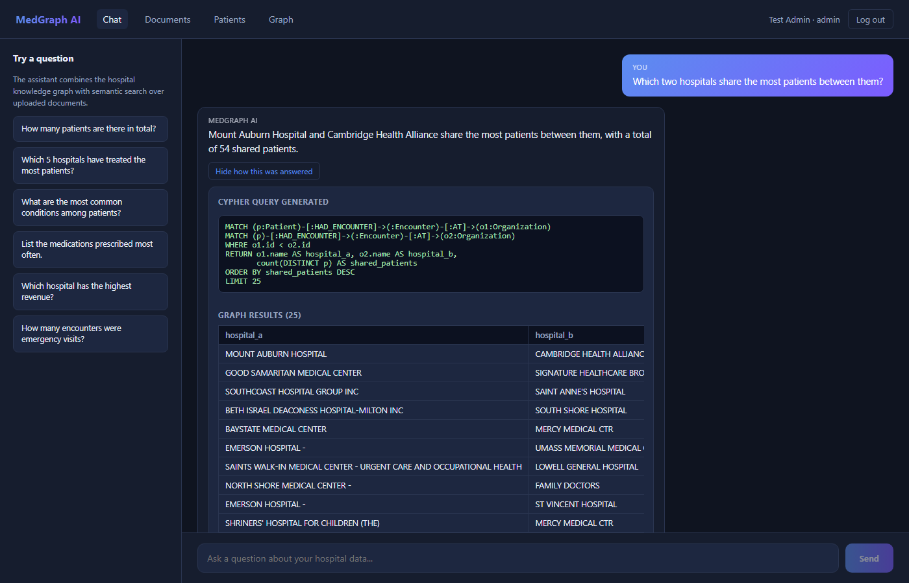
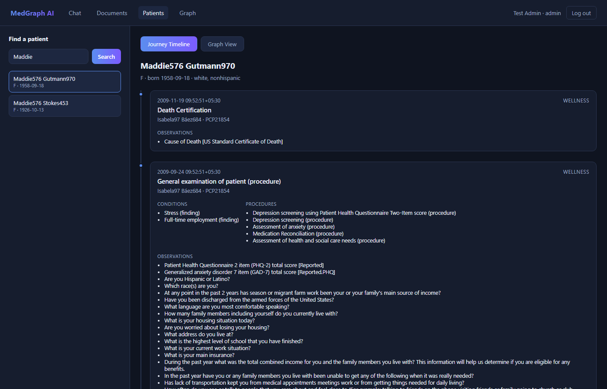
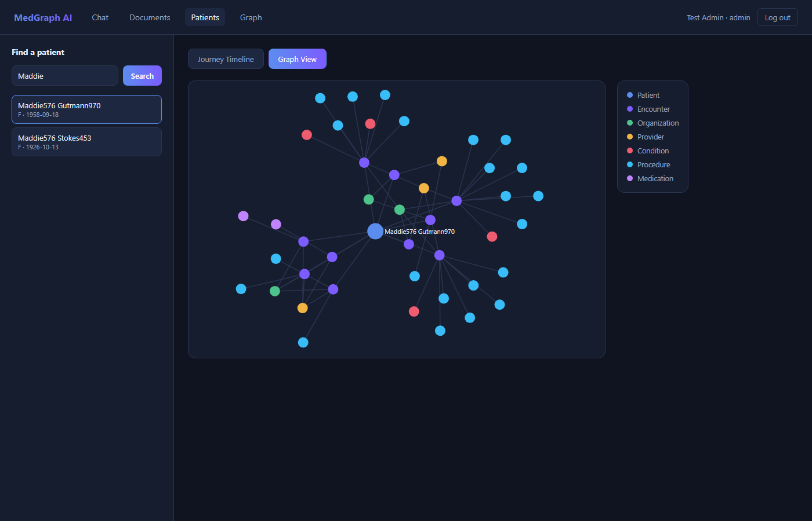
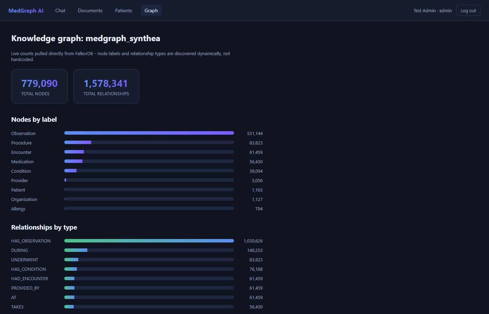

# MedGraph AI

**A hybrid GraphRAG system for cross-hospital clinical intelligence.**

MedGraph AI turns a multi-hospital healthcare network's data into a
knowledge graph and combines it with hybrid GraphRAG (graph traversal +
vector search) to answer natural-language questions about relationships
across the network — referral-like patterns, comorbidity clustering,
provider overlap, patient journeys — with every answer traceable back to
the exact Cypher query or document it came from.

## Problem statement

Hospital networks generate patient data across many hospitals, providers,
and record types. Conventional relational queries handle single-record
lookups well but struggle with questions that span *relationships* across
many entities (multi-hop joins that don't scale in SQL), and plain
vector-based RAG over documents has no notion of structured relationships
or aggregation at all. MedGraph AI builds a knowledge graph across the
network and answers relationship-level questions through natural
language, combined with semantic search over unstructured clinical
documents, in one hybrid, source-traceable interface.

## Key features

- **Knowledge graph**: 779K+ nodes / 1.5M+ relationships built from
  Synthea synthetic multi-hospital EHR data (patients, encounters,
  conditions, procedures, medications, observations, allergies,
  providers, organizations).
- **Text-to-Cypher GraphRAG agent** with **self-correction** — a failed
  or invalid query's error is fed back to the LLM and retried, rather
  than failing outright.
- **Multi-hop network queries** — comorbidity clustering, cross-hospital
  patient overlap, patient mobility across the network, shared-provider
  connections — the class of question that genuinely needs a graph, not
  just a SQL join.
- **Hybrid retrieval**: combines graph traversal with vector search
  (ChromaDB + sentence-transformers) over uploaded clinical documents,
  gracefully degrading when either source has nothing relevant.
- **RBAC-aware chat**: a doctor's queries are programmatically restricted
  to their own patients (validated, not just prompted) via a link between
  their account and a Provider node in the graph; admins are
  unrestricted; other roles have no clinical chat access.
- **Model resilience**: automatic fallback to a secondary LLM on quota
  exhaustion / overload, with per-call latency and token-usage logging.
- **Evaluation benchmark**: 22 hand-verified questions (lookups,
  aggregations, multi-hop, adversarial edge cases) scored automatically.
- **Document ingestion pipeline**: PDF/DOCX/TXT/image-OCR/CSV/XML
  parsing, LLM entity extraction, feeding both the relational store and
  the vector store.
- **Full-stack delivery**: FastAPI + PostgreSQL + SQLAlchemy/Alembic
  backend with JWT auth, and a React frontend with a chat UI that
  exposes the generated Cypher/graph rows/document matches behind every
  answer, a patient explorer (journey timeline + force-directed graph
  visualization), and live graph statistics.

## Screenshots

| Chat (with reasoning inspector) | Patient journey timeline |
|---|---|
|  |  |

| Patient subgraph visualization | Live graph statistics |
|---|---|
|  |  |

See [docs/ARCHITECTURE.md](docs/ARCHITECTURE.md) for the full system
design, data model, and RBAC/security notes.

## Tech stack

| Layer | Technology |
|---|---|
| Graph database | FalkorDB (Cypher) |
| Relational database | PostgreSQL + SQLAlchemy + Alembic |
| Vector store | ChromaDB + sentence-transformers |
| LLM | Google Gemini (configurable model + fallback chain) |
| Backend | FastAPI, JWT auth |
| Frontend | React 19 + Vite, d3-force (graph viz) |
| Containerization | Docker, docker-compose |

## Getting started

### Option A: Docker Compose (recommended)

```bash
docker compose up --build
```

This starts PostgreSQL, FalkorDB, the backend (`:8000`), and the
frontend (`:5173`). On first run the graph and vector store are empty -
see [docs/ARCHITECTURE.md](docs/ARCHITECTURE.md#loading-the-synthea-dataset)
for how to load the Synthea dataset.

### Option B: Local development

**Backend**
```bash
cd backend
python -m venv venv
venv/Scripts/activate        # or `source venv/bin/activate` on Linux/Mac
pip install -r requirements.txt
cp .env.example .env         # fill in GEMINI_API_KEY and DB credentials
alembic upgrade head
python run.py                 # http://localhost:8000, docs at /docs
```

**Frontend**
```bash
cd frontend
npm install
npm run dev                   # http://localhost:5173
```

You'll also need PostgreSQL and FalkorDB running locally (see
`docker-compose.yml` for the exact images/versions used).

## Evaluation

Run the benchmark and the graph-vs-vector-vs-hybrid comparison from
`backend/` with the venv active:

```bash
python -m app.eval.run_eval          # 22-question benchmark
python -m app.eval.compare_retrieval # graph vs vector-only vs hybrid
```

Both scripts self-report if the LLM's fallback model was used during the
run (which degrades answer quality) so results stay honestly labeled.

## Project structure

```
backend/app/
  agents/        text-to-Cypher, hybrid, and vector-only RAG agents
  api/v1/         FastAPI routers
  core/           config, auth deps, RBAC, LLM client, observability
  graph/          FalkorDB client, Synthea graph loader, hand-written queries
  ingestion/      document parsing (PDF/DOCX/OCR/CSV/XML) + chunking
  extraction/     LLM-based entity extraction from documents
  vectorstore/    ChromaDB manager
  eval/           benchmark, eval runner, comparison harness
  models/ schemas/ repositories/ services/   CRUD hospital domain layer
frontend/src/
  pages/          Login, Register, Chat, Documents, Patients, GraphStats
  components/     Navbar, PatientGraph (d3-force viz), PatientJourney
  api/            fetch client
  context/        auth context
```

## License

MIT
