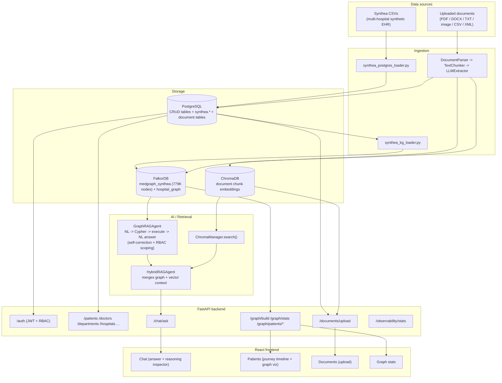

# Architecture

## System overview



## Why a graph, not just SQL or vector RAG

The core design decision of this project: **relational databases handle
single-record lookups well but degrade fast on relationship-level
questions** (multi-hop joins, pattern-matching across shared entities),
and **plain vector RAG has no notion of structured relationships or
aggregation at all** - it can retrieve similar text, not compute "which
two hospitals share the most patients."

Concretely, in this dataset:

- Every **Provider**'s encounters are all at one home Organization -
  providers do not cross hospitals. This was verified directly against
  the graph, not assumed.
- ~98% of **Patients** DO cross hospitals - the real cross-hospital
  network signal in this data is patient mobility, not provider overlap.
  This is exactly the kind of fact that's easy to get wrong by assumption
  and easy to verify by querying the graph directly.
- Comorbidity clustering (`(:Patient)-[:HAS_CONDITION]->(:Condition)`
  self-joined through the patient) is a natural graph pattern; the
  equivalent SQL is an awkward self-join that gets slower and harder to
  read as the schema grows.

## Knowledge graph schema

```
(:Patient {id, first_name, last_name, birthdate, deathdate, gender, race,
            ethnicity, address, city, state, healthcare_expenses, ...})
(:Organization {id, name, address, city, state, revenue, ...})      -- a hospital
(:Provider {id, name, gender, speciality, ...})
(:Encounter {id, start_time, stop_time, encounter_class, description, ...})
(:Condition {id, start_date, end_date, code, description})
(:Procedure {id, start_time, stop_time, code, description, base_cost, ...})
(:Medication {id, start_time, stop_time, code, description, ...})
(:Observation {id, observation_date, category, code, description, value, ...})
(:Allergy {id, start_date, stop_date, code, description, severity1, ...})

(:Patient)-[:HAD_ENCOUNTER]->(:Encounter)
(:Encounter)-[:PROVIDED_BY]->(:Provider)
(:Encounter)-[:AT]->(:Organization)
(:Provider)-[:WORKS_AT]->(:Organization)
(:Patient)-[:HAS_CONDITION]->(:Condition)          (:Encounter)-[:HAS_CONDITION]->(:Condition)
(:Patient)-[:UNDERWENT]->(:Procedure)              (:Procedure)-[:DURING]->(:Encounter)
(:Patient)-[:TAKES]->(:Medication)                 (:Medication)-[:DURING]->(:Encounter)
(:Patient)-[:HAS_OBSERVATION]->(:Observation)      (:Encounter)-[:HAS_OBSERVATION]->(:Observation)
(:Patient)-[:HAS_ALLERGY]->(:Allergy)              (:Encounter)-[:HAS_ALLERGY]->(:Allergy)
```

**Note**: there is no `REFERS_TO` relationship. "Referral"-style questions
must be answered by inferring network structure from shared entities
(e.g. patients seen by providers at more than one organization), not by
looking for a stored referral fact - the agent's prompt is written to
know this explicitly, and it's the reason a "which doctors refer
patients elsewhere" question in the eval benchmark is deliberately
adversarial (see `backend/app/eval/benchmark.py`).

### Why two FalkorDB graphs exist

- **`medgraph_synthea`** - the real, large knowledge graph described
  above. This is what the GraphRAG agent queries
  (`settings.FALKOR_SYNTHEA_GRAPH`).
- **`hospital_graph`** - a small graph fed by the CRUD hospital domain
  (`/graph/build`) and by the document-upload pipeline
  (`HospitalGraphBuilder.create_patient_graph`). Kept separate because it
  models a different, much smaller "live" hospital (staff-entered
  patients/appointments), not the Synthea population
  (`settings.FALKOR_GRAPH`).

An earlier, orphaned third graph (`medgraph` - the default graph name
before either loader had run) was deleted during cleanup; if you're
setting this up fresh, only these two graphs should ever be created.

## RBAC design (and its real limits)

A "doctor" account can be linked to a real `Provider.id` in the graph
(`users.provider_id`, set at registration by searching
`/graph/providers/search`). When that account calls `/chat/ask`:

1. The agent's prompt includes a mandatory access-control instruction
   naming their `provider_id`.
2. **The generated query is then validated, not just trusted**:
   `GraphRAGAgent.is_scoped_to_provider()` checks the query textually
   constrains any `Patient` traversal to that provider. If it doesn't,
   the query is rejected and regenerated through the same
   self-correction loop used for syntax errors.
3. A doctor account with no linked provider gets `403`, not unrestricted
   access (fail closed). Receptionist accounts get no clinical chat
   access at all. Admin is unrestricted.

**Honest limitation**: this is prompt-plus-validation scoping, not
database-native row-level security - FalkorDB has no ACL system. A
sufficiently adversarial or malformed query could in principle satisfy
the textual check without semantically restricting results. This is a
reasonable, honestly-scoped approach for this project, not a claim of
production-grade security. Vector document search is not scoped by
provider at all yet, since uploaded-document patient IDs and Synthea
graph patient/provider IDs are different identifier spaces.

## Resilience: LLM model fallback + observability

`core/llm_client.py` tries `GEMINI_MODEL` first, retrying on transient
`503` overload with backoff; on quota exhaustion (`429`) or repeated
failure it falls through to `GEMINI_MODEL_FALLBACKS`. Every call's
latency, token usage, and whether the fallback model served the request
is logged in-process (`core/observability.py`, capped at 500 entries)
and exposed via `/observability/stats` (admin-only). This is what makes
it possible to tell, after the fact, whether a wrong-looking answer was
a real capability gap or the weaker fallback model answering under
quota pressure - both `run_eval.py` and `compare_retrieval.py` also
self-report their own fallback rate for this reason.

## Loading the Synthea dataset

The Synthea CSVs (in `backend/data/synthea/`) load in two stages:

```bash
cd backend
python -m app.ingestion.synthea_postgres_loader   # CSVs -> Postgres (synthea.* schema)
python -m app.graph.synthea_kg_loader             # Postgres -> FalkorDB (medgraph_synthea)
```

The second script creates an index on `.id` for every node label before
loading - without it, the `MATCH (x {id: ...})` lookups used throughout
loading degrade from sub-millisecond to full label scans as the graph
grows, which is the difference between the full load taking minutes vs.
hours once you're past a few hundred thousand nodes.

## Evaluation methodology

`backend/app/eval/benchmark.py` defines 22 questions across four
categories - lookup, aggregation, multi-hop, and adversarial edge cases
(prompt-injection-style write attempt, nonexistent-entity lookup,
numeric threshold, 3-hop join, out-of-schema "referral" question) - each
with a ground-truth value computed by directly running a hand-verified
reference Cypher query against the graph, not guessed. `run_eval.py`
scores the agent's own generated query's results against that ground
truth and reports per-category accuracy plus a full JSON trace.
`compare_retrieval.py` runs a subset of the same questions through
graph-only, vector-only, and hybrid agents to make the "why graph"
argument with a real number instead of an assertion.

## Docker notes / a real debugging story

Getting `backend/Dockerfile` to build reliably surfaced two genuine bugs,
not just infrastructure setup:

1. **Both `requirements.txt` files were UTF-16 encoded** (a Windows
   artifact) - this would silently break `pip install -r requirements.txt`
   on any Linux machine or in Docker. Regenerated as clean UTF-8 via
   `pip freeze`.
2. **`torch`'s default Linux wheel resolution pulls in the full
   `nvidia-*-cuXX` dependency chain** (cudnn/cublas/cufft/... - several
   hundred MB each) even though this app only ever runs torch on CPU
   (sentence-transformers embeddings). This wasn't just wasted disk space -
   it was the actual cause of repeatedly-failing builds: pip kept hitting
   hash-verification failures on a different huge `nvidia-cu*` wheel each
   time, which looked like transient network corruption at first but was
   really the same root cause every time (a multi-hundred-MB download,
   unnecessary in the first place, failing in transit). The fix is to
   install the CPU-only build explicitly before the rest of the
   requirements:
   ```
   pip install torch==2.13.0 torchvision==0.28.0 \
       --extra-index-url https://download.pytorch.org/whl/cpu
   ```
   (`--extra-index-url`, not `--index-url` - the latter replaces PyPI
   entirely and breaks resolution of torch's own transitive dependencies
   like `typing-extensions`.) This also cut the image's dependency
   install time from being dominated by multi-hundred-MB CUDA downloads
   to a normal `pip install`.

A third, smaller fix: `OCRExtractor` originally instantiated its EasyOCR
`Reader` at class-definition time, meaning the *entire app* blocked at
startup on an EasyOCR model download the first time the container ran -
even for requests that never touch OCR. Made it lazy (loaded on first
actual call to `image_to_text`), the same pattern already used for the
sentence-transformers embedding model in `rag/embeddings.py`, and gave
its cache directory (`~/.EasyOCR`) its own volume in `docker-compose.yml`
so the download only ever happens once.
